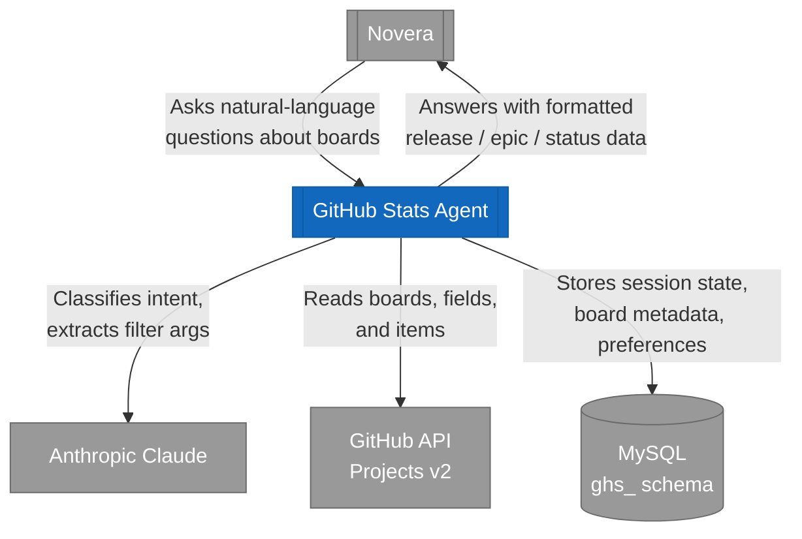
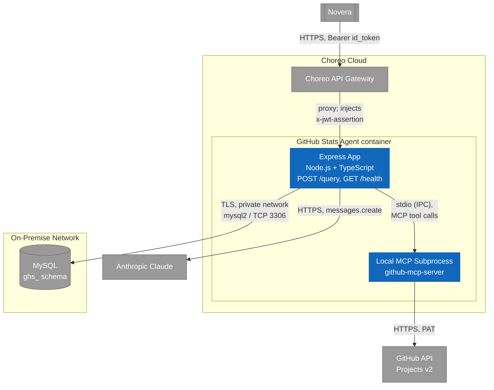
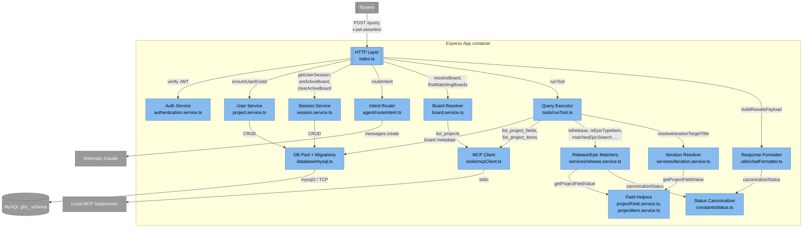
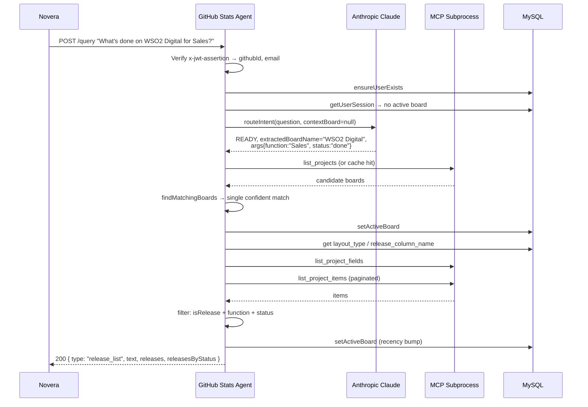
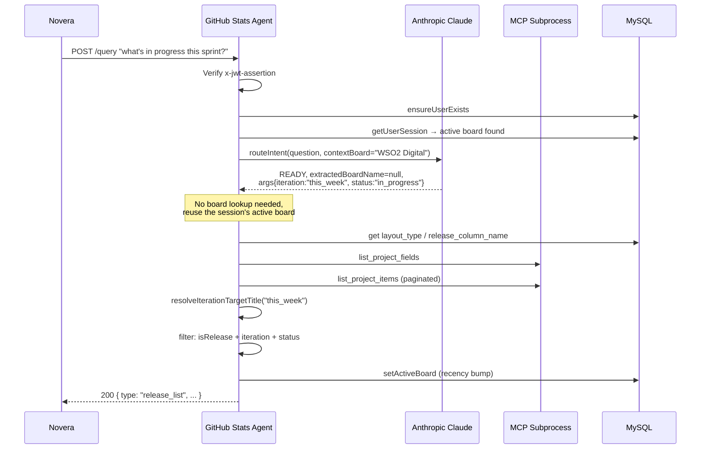

# GitHub Stats Agent Architecture

A stateless-per-request backend agent that answers natural-language questions about GitHub Projects v2 boards: releases/features by iteration, team/function, epic, or status. It is called by Novera through the Choreo API Gateway, the same way Novera calls its Leave/Menu/People backends: a Bearer id_token that the gateway turns into an `x-jwt-assertion` header. Phase scope is **read-only board querying** over a single REST endpoint (`POST /query`); this service has no chat surface of its own and never talks to a WSO2 employee directly. Novera is the only caller, and the employee only ever sees Novera's rendering of the response.

The defining architectural difference from a typical Claude-in-the-loop agent: **Claude is used only once per request, purely to classify intent and extract filter parameters into a strict JSON schema.** There is no agentic tool-calling loop; board lookup, item retrieval, filtering, and response formatting are all deterministic TypeScript executed after the single classification call returns.

## System Context (C4 Level 1)

Drawn with Mermaid `flowchart` rather than `C4Context`, since the C4 model is notation-independent and Mermaid's flowchart renders reliably without the label-overlap issues of `C4Context`. C4 conventions are preserved through colour and shape: double-bordered box for the in-scope system, plain boxes for external systems and actors.



There is no human actor at this level. The caller is a software system, not a person, and this service only ever sees the question text and a verified JWT, nothing about the chat session or the end user behind it. Every downstream call (MySQL scoping, GitHub reads) is keyed off the identity extracted from that JWT, never off anything Claude returns.

## Container & Deployment Diagram (C4 Level 2)

Zooms inside the boundary and adds deployment topology, which the C4 model explicitly permits at this level. This service runs as a Choreo-managed backend, sitting behind the Choreo gateway as the thing being called rather than calling out through Choreo itself.



### Container responsibilities

- **Express App**: the only HTTP-facing process. Hosts `POST /query` and `GET /health`; verifies the inbound `x-jwt-assertion`; runs the single Claude classification call; resolves/switches boards; executes and filters the board query; formats the markdown response.
- **Local MCP Subprocess** (`github-mcp-server`): spawned via stdio, not a remote MCP server. All GitHub reads (`list_projects`, `list_project_fields`, `list_project_items`) go through it, authenticated with a GitHub Personal Access Token passed in its environment.
- **MySQL (`ghs_` schema)**: four tables holding users, per-board layout metadata, per-user session/active-board state, and recently-used board preferences. Reached over a privately-networked connection rather than a Choreo-managed cloud database, a materially different (and likely slower/less elastic) network path worth calling out for anyone reasoning about latency or availability.

### Why one container, one MCP tool

There's no separate worker or scheduler; the whole request lifecycle (auth → intent → board resolution → item fetch → filter → format) runs synchronously inside one Express request handler. On the GitHub side, the MCP server exposes a single tool, `projects_list`, multiplexed by a `method` argument (`list_projects` / `list_project_fields` / `list_project_items`) rather than one MCP tool per operation, so this agent's tool surface is one indirection layer flatter than it looks.

## Component Diagram (C4 Level 3)

Zooms inside the **Express App** container. Components map to the `src/` layout.



### Component responsibilities

| Component | File(s) | Responsibility |
|---|---|---|
| **HTTP Layer** | `src/index.ts` | Express setup (`express.json({limit:"10kb"})`), `/health`, `POST /query` orchestration end-to-end: auth gate → user upsert → session read → intent routing → board switch/lookup branching → query execution → response formatting → error mapping (`504` on timeout, `500` otherwise, generic messages only). |
| **Auth Service** | `src/services/authentication.service.ts` | Verifies `x-jwt-assertion` via `jwks-rsa` (RS256 only), JWKS endpoint chosen by `AUTH_ISSUER` (`choreo` vs `asgardeo`). Requires `exp` plus `github_id`/`sub` and `email` claims; returns `null` on any failure so the caller 401s. |
| **Intent Router** | `src/agent/routeIntent.ts` | One Claude call (`claude-sonnet-4-6`, `temperature: 0`, `max_tokens: 300`) per request; system prompt defines the capability list and a strict output schema. `safeParse` defensively extracts the first `{...}` block, validates `status`, backfills missing `args` fields, and falls back to `REQUIRES_BOARD_SELECTION` on any parse anomaly, so the model can never crash the request. A regex-based heuristic (`detectIterationFromRawInput`) recovers `this/next/previous week` from raw text if the model omits it. |
| **Session Service** | `src/services/session.service.ts` | Reads/writes the caller's `active_board_name` / `active_project_id`; `setActiveBoard` also upserts a recency row into `ghs_user_project_preferences` so `getSavedBoards` can offer a "recently used" list. |
| **Board Resolver** | `src/services/board.service.ts` | `getBoards` (5-minute in-memory cache per owner, paginated `list_projects`, `MAX_PAGES = 10`), `findMatchingBoards` (exact title match → all-tokens-present match → any-token-present fallback marked `confident: false`), `resolveBoard` (wraps match count into `FOUND` / `NONE` / `MULTIPLE`). |
| **User Service** | `src/services/project.service.ts` | Despite the filename, this owns `ghs_users` identity upserts, not project data. `ensureUserExists` handles the email-change and duplicate-email-race cases via the unique constraint on `email`. |
| **Query Executor** | `src/tools/runTool.ts` | Looks up per-board `layout_type` / `release_column_name` from MySQL, fetches project field IDs, paginates `list_project_items` (`MAX_ROUNDS = 20`, de-duplicated by item key), then branches into epic-list / epic-search / release-list filtering. |
| **Release/Epic Matchers** | `src/services/release.service.ts` | Type/label-based classification (`isRelease`, `isEpicTypeItem`), `matchesEpicSearch` + `getEpicLabelText` (distinguishes an item *being* an epic (label `epic` / `type/epic`) from an item *belonging to* one (label `epic/<name>`)), `belongsToFunction`, `matchesStatusFilter` (alias-aware via the Status Canonicalizer). |
| **Iteration Resolver** | `src/services/iteration.service.ts` | Computes iteration date windows from `start_date` + `duration`, determines the "current" iteration, and resolves `this_week` / `next_week` / `previous_week` into a concrete iteration title by scanning every distinct iteration seen across fetched items and sorting by start date. |
| **Field Helpers** | `src/services/projectField.service.ts`, `src/services/projectItem.service.ts` | Thin, case-insensitive lookups: field ID by name, field value by name on a given item. Shared by the matchers and the iteration resolver. |
| **Status Canonicalizer** | `src/constants/status.ts` | Maps a large alias set (`completed`, `shipped`, `wip`, `qa`, `backlog`, ...) onto four canonical buckets (`done`, `in_progress`, `testing`, `todo`), including a longest-alias-first token-window scan for phrases embedded in longer strings. |
| **Response Formatter** | `src/utils/chatFormatter.ts` | Builds the markdown text for each response shape (release list grouped/sorted by canonical status, epic list, epic search results), plus multi-board variants not currently wired into `index.ts`. |
| **MCP Client** | `src/tools/mcpClient.ts` | Spawns the `github-mcp-server` binary over stdio (`toolsets: repos,issues,projects`), 10s connect timeout, single shared `Client` instance reused for the process lifetime. |
| **DB Pool + Migrations** | `src/database/mysql.ts` | `mysql2` connection pool; conditionally (`RUN_MIGRATIONS=true`) creates the database, creates the four base tables, and idempotently applies `ALTER TABLE` column migrations (tolerating `ER_DUP_FIELDNAME`, failing hard on a missing table). |

## Dynamic View: named-board query, no active session



## Dynamic View: follow-up query on an active board



### Notes on the flows

- **Board resolution is only attempted when needed.** A question naming a board runs `findMatchingBoards`/`resolveBoard`; a question with no board name and no active session falls through to a saved-boards prompt; a question with no board name but an active session skips lookup entirely.
- **Ambiguous matches never silently pick a board.** `confident: false` (partial/any-token match) always returns a confirmation prompt (`board_selection`) instead of proceeding, even when there's exactly one candidate.
- **A pure board-switch phrased as a query short-circuits.** If `extractedBoardName` resolves confidently but the intent carries no other query args (`iteration`, `function`, `epicSearch`, `status`, `listEpics`), the handler returns a `board_acknowledgment` and does not run `runTool`.

## Authentication & authorization

- **Inbound:** every `/query` call must carry `x-jwt-assertion` (Choreo-injected after gateway-level validation of Novera's Bearer id_token, the same `Bearer id_token` → Choreo → `x-jwt-assertion` pattern Novera's own doc describes for its Leave/Menu/People backends). No header → `401`.
- **Verification:** RS256 only, via JWKS. `AUTH_ISSUER` selects between a Choreo STS JWKS endpoint and an Asgardeo JWKS endpoint, so the same codebase can validate tokens minted by either, depending on how it's fronted.
- **Claims required:** `exp`, and either `github_id` or `sub`, plus `email`. Missing any → treated as unauthenticated.
- **Identity provenance:** `githubId`/`email` come **only** from the verified JWT and are the sole scoping key for every MySQL row (`ensureUserExists`, session, preferences) and every GitHub read (`owner` comes from `GITHUB_OWNER`, an env var, not from the token or from Claude). Because there is no agentic tool-calling loop, Claude's output never contains an identity or an ID that gets used to scope a data access; it only contains classification/filter data (board name, iteration, function, status). This is a meaningfully smaller trust boundary than an agent that lets an LLM choose tool arguments feeding into per-record access.
- **GitHub-side auth:** a single Personal Access Token (`GITHUB_PERSONAL_ACCESS_TOKEN` / `GITHUB_TOKEN`) is handed to the local MCP subprocess at spawn time; all GitHub reads run as that one token/identity, scoped to the single `GITHUB_OWNER` org configured for the deployment, not per-caller.

## Intent classification contract

`routeIntent` sends exactly one Claude message per request and expects **only** this JSON shape back:

```json
{
  "status": "READY" | "REQUIRES_BOARD_SELECTION" | "UNSUPPORTED",
  "extractedBoardName": "string | null",
  "isSwitchingBoard": "boolean",
  "args": {
    "iteration": "string | null",
    "function": "string | null",
    "epicSearch": "string | null",
    "listEpics": "boolean",
    "status": "string | null"
  },
  "conversationalResponse": "string | null"
}
```

`safeParse` treats this contract as adversarial input from an unreliable text generator, not a typed function return: it regex-extracts the first `{...}` block (in case the model wraps it in prose despite instructions), validates `status` against the allowed enum, backfills every `args` field that's missing or the wrong type, and falls back to a safe `REQUIRES_BOARD_SELECTION` response on any parse or shape failure rather than propagating an exception. A separate regex heuristic re-derives the iteration keyword from the raw user text as a backstop when the model's `args.iteration` comes back empty on an otherwise-`READY` result.

## Query execution & filtering pipeline

1. **Board metadata**: `ghs_project_board_metadata` supplies `layout_type` (`ITERATION_BASED` default, or `FLAT_KANBAN`) and `release_column_name` (default `"Done"`) per board. No row yet for a board → both defaults apply.
2. **Field selection**: only the field IDs actually needed are requested: `Iteration` (iteration-based boards only), `Function` (only if the intent filters on it), `Type` and `Status` (always, if present on the board).
3. **Pagination**: `list_project_items` is paginated up to `MAX_ROUNDS = 20` × `PER_PAGE = 100` (2,000-item ceiling), de-duplicated by item ID/URL/number; a warning is logged if the ceiling is hit, since results would then be a partial view.
4. **Branch on request shape:**
   - `listEpics: true` → epic-type items, filtered by function/status.
   - `epicSearch` set → items whose `epic/<name>` label or title matches the search term, filtered by function/status, annotated with the resolved epic label.
   - otherwise → "release" items (`isRelease`), filtered by function, explicit status, **and** a time-or-status filter that differs by board layout:
     - **iteration-based:** resolves `this_week` / `next_week` / `previous_week` to a concrete iteration title by scanning every iteration window seen in the fetched items, then matches the item's iteration title against it. If no iteration resolves (e.g. no items carry a "current" iteration), the result is an empty list rather than an unfiltered one.
     - **flat kanban:** there's no iteration concept, so the board's configured `release_column_name` (e.g. `"Done"`) stands in for "released"; an item counts if its `Status` text equals that column name.
5. **Formatting**: `buildResultsPayload` groups/sorts by canonical status and renders markdown via the Response Formatter, returning one of `epic_list`, `epic_search_results`, or `release_list`.

## Data model (`ghs_` MySQL schema)

| Table | Purpose | Notes |
|---|---|---|
| `ghs_users` | One row per linked GitHub identity | `email` unique; `encrypted_access_token` column exists but nothing in the current code path writes to it |
| `ghs_project_board_metadata` | Per-board layout config | `layout_type` (`ITERATION_BASED` / `FLAT_KANBAN`), `release_column_name`; absence of a row falls back to iteration-based + `"Done"` |
| `ghs_user_session_state` | Per-user active board | `active_board_name`, `active_project_id` are the only columns the current code reads/writes; the rest are currently unused |
| `ghs_user_project_preferences` | Recently-used boards per user | Composite PK (`github_id`, `project_id`); `last_accessed_at` bumped on every `setActiveBoard` call to drive the "recent boards" prompt |

### Migrations

Table creation and `ALTER TABLE` migrations only run when `RUN_MIGRATIONS=true` at startup; otherwise the app assumes the schema already exists and just opens a pool against it. Migrations are applied one statement at a time, tolerating "column already exists" (`ER_DUP_FIELDNAME`, errno 1060) as a no-op, but treating a missing table (errno 1146) as fatal.

## Tooling / MCP surface

The GitHub side is a single MCP tool, `projects_list`, dispatched by a `method` argument, so there is no per-operation tool registration on the Anthropic side, since Claude never calls it directly.

| `method` | Caller | Notes |
|---|---|---|
| `list_projects` | Board Resolver | Paginated (`first: 100`, cursor-based), 5-minute cache per `owner`, `MAX_PAGES = 10` |
| `list_project_fields` | Query Executor | One call per query, used to resolve field IDs before fetching items |
| `list_project_items` | Query Executor | Paginated (`per_page: 100`), `MAX_ROUNDS = 20`, scoped to the field IDs actually needed |

Both `getBoards` and `runTool` parse the MCP text-content response as JSON directly (`safeJsonParse`), rejecting anything that doesn't start with `{` or `[`. `getBoards` additionally retries once, without the abort signal, on a `TypeError` mentioning `v3Schema`, a workaround for a client-library quirk when a signal is passed; `runTool`'s calls do not have this same fallback. Tracked as follow-up work (`<issue link>`) to apply the same retry to `runTool` if the failure mode shows up there too.

## Error handling & resilience

- `withTimeout` wraps board resolution (`30s`) and item retrieval (`60s`) in an `AbortController` race; a timeout maps to `504` with a generic "took too long" message.
- All other failures map to `500` with a generic message; the full error, including any GitHub/MySQL detail, is only ever `console.error`'d server-side, never returned to the caller.
- Pagination loops have hard ceilings (10 pages of boards, 20 pages of items) specifically so a runaway or misbehaving upstream can't turn into an unbounded loop; both log a warning when the ceiling is hit so a truncated result is at least visible in logs.

## Environment

- `ANTHROPIC_API_KEY` (required, fail-fast if missing)
- `GITHUB_PERSONAL_ACCESS_TOKEN` or `GITHUB_TOKEN` (required by the MCP client; throws if neither is set)
- `MCP_SERVER_PATH` (default `./github-mcp-server`)
- `GITHUB_OWNER` (default `org-owner`): the single GitHub org this deployment serves; not derived from the caller or the token
- `DB_HOST`, `DB_USER`, `DB_PASSWORD`, `DB_NAME` (default `github_stats_db`)
- `RUN_MIGRATIONS` (default unset/false): gates database/table creation and column migrations at startup
- `AUTH_ISSUER` (`choreo` default, or `asgardeo`) plus `CHOREO_JWKS_URI` / `ASGARDEO_JWKS_URI` overrides
- `PORT` (default `8080`)
